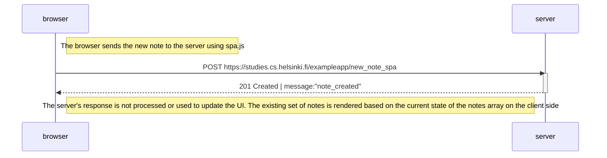

```mermaid
sequenceDiagram
    participant browser
    participant server

    Note right of browser: The browser sends the new note to the server using spa.js
    browser->>server: POST https://studies.cs.helsinki.fi/exampleapp/new_note_spa
    activate server
    server-->>browser: 201 Created | message:"note_created"
    deactivate server
    Note right of browser: The server's response is not processed or used to update the UI. The existing set of notes is rendered based on the current state of the notes array on the client side
```